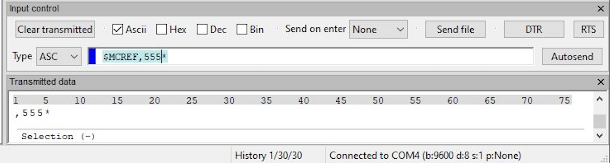
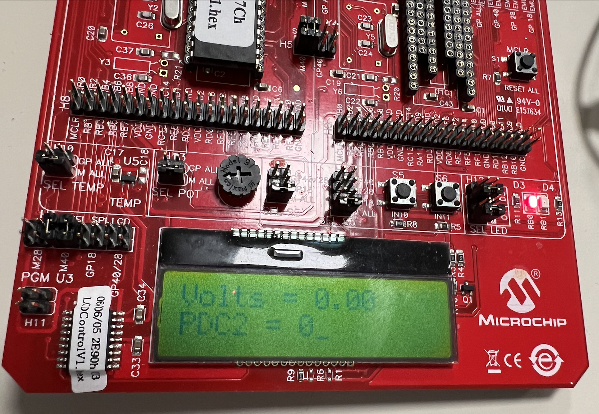
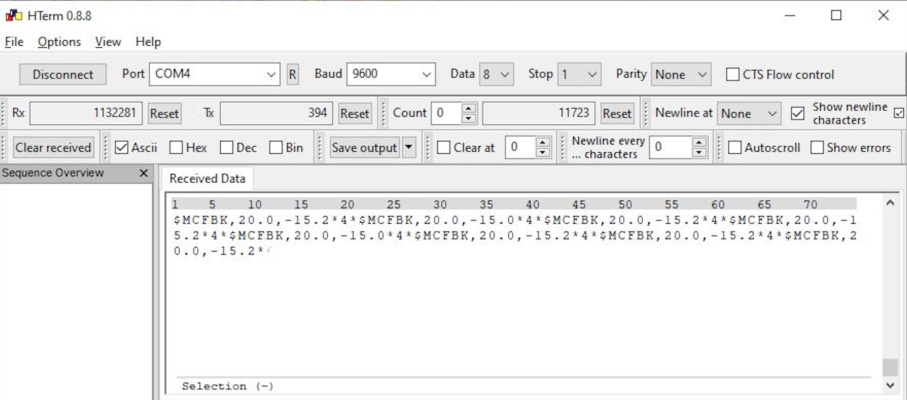

[Embedded System](https://corsi.unige.it/en/off.f/2022/ins/59432?codcla=10635)<br>
**Programmer(s):** [Ankur Kohli](https://github.com/ankurkohli007), [Ammar Iqbal](https://github.com/ammariqbal48) & [Basit Akram](https://github.com/abdulbasit656)<br>
[M.Sc Robotics Engineering](https://corsi.unige.it/corsi/10635)<br>
[University of Genoa (UniGe)](https://unige.it/en)<br>
**Supervisor:** [Prof. Enrico Simetti](https://rubrica.unige.it/personale/UkNGW15g)

## Abstract ##

This assignemnt report is about the Embedded Systems in which the of timers, interrupts, SPI, UART, parser, ADC, PWM, Scheduling, and so on to determine about the operations performance. The specific goal in this case is that to know the implementation of operations with the real- time hardware. Also, case study of a real time control system. This report to bring the light on Embedded Systems for operations. Further- more, the purpose of this report is to provide the approaches used during the development of code and implementation on microcontroller board. For this assignment, MPLAB IDE Software, XC16 Compiler and Microchip Microcontroller Board, HTerm serial software is used and also Embed- ded C programming is platform for the development of code.

## Introduction ##

A microprocessor-based computer system with software that is intended to carry out a specific task, either independently or as a component of a larger system, is known as an embedded system. An integrated circuit built to perform computing for real-time processes is at the heart of the system.

From a single microcontroller to a group of connected processors with networks and peripherals, complexity can range from having no user interface to having intricate graphical user interfaces. Depending on the task for which it is created, an embedded system’s complexity varies greatly.

Applications for embedded systems include hybrid cars, avionics, digital watches, microwaves, and more. Embedded systems consume up to 98 percent of all produced microprocessors.

## UART Protocol used in this assignment ##

* The PC sends $MCREF,RPM*, where RPM is a value going from 0 to 1000. The references can come as fast as the baudrate allows. Example: $MCREF,400*
* The micro sends $MCFBK,CURRENT,TEMP*, where CURRENT is the current value in Amperes and TEMP is the temperature value at 1 Hz. Example: $MCFBK,4.3,22.2*

## Requirements for the Assignment ##

1. execute a control loop at 200 Hz.
2. the reference speed for the motor is received through UART communications. Setup bau- drate at 9600 bps.
3. set the voltage to the armature of the DC motor using PWM2H. Assume that the motor spins at 1000 RPM at 5V.
4. simulate an analog current sensor using AN2 (potentiometer). The sensor outputs 3 V at 0 A, and has a scale of 10 A/V.
5. send the current and temperature (AN3) feedback through UART at 1 Hz.
6. Whenever button S6 is pressed, clear the first row and reset the characters received counter.
7. blink D3 at 1 Hz to show that the program is running correctly.
8. turn on D4 whenever the current exceeds 15A.

## Scenarios of the assignment ##

### Scenario 1

This scenario is divided into two task.

* **Task 1 (PC to Controller):** In this task Motor is control using frequency 200 Hz.
      <ul>
      <li>In this task, values were sent from PC (Personal Computer) to microcontroller board using UART.</li>
      <li>Motor is controlled at a frequency of 200 Hz.</li>
      <li>Moreover, receive value from UART will save in the circular buffer.</li>
      <li>After storing values, these values will be decoded by using parser _(parser.zip is already given during the task implementation)_.</li>
      <li>Decoded value will be the RPM of the motor. This will generate PWM.</li>
      </ul>
* **Task 2 (Controller to PC):** In this task, monitoring of analog values at 1 Hz frequency.
      <ul>
      <li>In this task, values were received from microcontroller to PC. On microcontroller, there were enormous analog pins to receive analog data from   pins such as temperature sensor, potentiometer, and so on.</li>
      <li>Analog values were converted into digital values using ADC which were received on PC.</li>
      <li>Analog input values are current, temperature, at 1 Hz frequency.</li>
      </ul>
### Scenario 2

There are two task as described below:

* **Task 1:** In this task, reads a value from the potentiometer AN2 pin. These value will range from 0 to 1023. Now, these values were mapped into voltage and current. For voltage we used map function as given below:

**General map function:**

<p align="center">
     output_value = map(input_value, input_minimum_value, input_maximum_value, output_minimum_value, output_maximum_value)
</p>

**Map function in our case:**

<p align="center">
      voltage = map (volt, 3, 5, 0, 20)
</p>
After mapping into voltage, using these values and remap to get current values. For current values below are the ranges:
<p align="center">
      3V = 0A <br> 
      4V = 10A <br>
      5V = 20A <br>
</p>

where V = Voltage, A = Ampere <br>

**Map function for current values:**

<p align="center">
      current = map (AN2, 0, 1023, 0, 5)
</p>

Here, current = output value after map function, AN2 = input value from analog pin of the controller, 0 = input minimum value, 1023 = input maximum value, 0 = output minimum value, 5 = output maximum value.

* **Task 2:** This task will read temperature value from AN3 pin of controller board. This tem- perature value will ranges from 0 to 1023.

Below are the Temperature senor specifications:

* Temperature sensor, U5, is a -40°C to +125°C linear output TC1047A connected to analog channel AN3 of the dsPIC30F device through header H10.
* The output of the temperature sensor is fed directly to the dsPICDSC device.
* The output voltage range for the TC1047A is typically 750 mV at +25°C.
* The TC1047A exhibits a typical 10 mV/C voltage slope.

After receiving the temperature value from AN3 pin mapping these value from -40°C to +125°C in the form of voltage. For temperature values below are the ranges:

<p align="center">
      0.1V = -40°C <br> 0.5V = 0°C <br> 0.75V = 25°C <br> 1.75V = +125°C<br>
</p>

The aforementioned values were calculated by the dry run of the formula as given below:
<p align="center">
    Temp = AN3 X Num -40
</p>

where, Temp = Output value, AN3 = Reading analog pin value (temperature) from controller, Num = multiplier and value is 0.161290323.

After this remapping the temperature value into voltage by using the formula:

<p align="center">
   V = map (Temp, -40, 125, 0.1, 1.75)
</p>

Here, V = voltage, Temp = input temperature value, -40 = input minimum temperature value, 125 = input maximum temperature value, 0.1 = output minimum value, 1.75 = output maximum value.

### Scenario 3

In this scenario, blinking of LED will takes place when the execution is implemented and running successfully.

* Blink D3 (LED) at 1 Hz to show that the program is executing correctly.
* Turning on D4 (LED) whenever the current exceeds 15A.

#### Synchronization of Scenario 1, 2 & 3

For the synchronization of scenario 1, 2 & 3 that will work simultaneously we used Scheduling approach to achieve the desired goal. Scheduling helps to execute multiple task at a time. For this highest frequency task will execute first because this task have the highest priority and vice versa. 

* First count the periods. When the counter is bigger than the threshold it means that the task is active and ready to be executed. Code structure is shown below for the above mentioned statement: 

```c
void scheduler() 
{
 int i;
 int executed = 0;
 for (i = 0; i < MAX TASKS; i++) 
  { 
   schedInfo[i]. n++;
    if (schedInfo[i].n >= schedInfo[i].N) 
      { 
       switch(i) 
        {
         case 0:
         task1 ();
         break;
         case 1:
         task2 ();
         break;
         case 2:
         task3 ();
         break;
         ... 
        }
     schedInfo[i].n = 0; 
      }
  }
}
```
where, N = number of periods, n = how many times elapsed since the last execution; when it will reach the task let’s say 3 and n = 10 than it means that now we should again execute the task 3.

* All the task which are ready are executed within the same orbit (multi task).

```c
//**********SCENARIO 01 FUNCTION**********//

void Motor_Control_Task(){
    // parser initialization
    parser_state pstate;
	pstate.state = STATE_DOLLAR;
	pstate.index_type = 0; 
	pstate.index_payload = 0;   
    
    IEC1bits.U2RXIE = 0;
    int avl = avl_bytes(&circularBuffer);
    IEC1bits.U2RXIE = 1;
 
    int count = 0;
    while (count < avl) {
        char byte;
        int rpm;
        IEC1bits.U2RXIE = 0;
        read_cb(&circularBuffer, &byte);            //read data from buffer
        IEC1bits.U2RXIE = 1;

        int ret = parse_byte(&pstate, byte);        //send data to parser to decode it

         if (ret == NEW_MESSAGE) {
             if (strcmp(pstate.msg_type, "MCREF") == 0) {
                ret = extract_integer(pstate.msg_payload, &rpm);
                
                //ANOTHER WAY TO DO THE ABOVE TASK IS COMMENTED DOWN
                /*memcpy(string, pstate.msg_payload , pstate.msg_payload);
                string[(int) pstate.msg_payload] = '\0';
                write_string_LCD(string); */
                
                if (ret == 0) {
                    if (rpm < 0) {
                        send_string_uart("INVALID RPM");
                    } else {
                        char str[16];
                        double volt = map(rpm, 0.0, 1000.0, 0.0, 5.0);   //recieved rpm is to map on the value ranges between 0 to 5 volts.
                        PDC2 = volt * 2 * PTPER;            //generate duty cycle

                        sprintf(str, "Volts = %.2f", volt);
                        move_cursor_first_row(0);
                        clear_LCD(0);
                        move_cursor_first_row(0);
                        write_string_LCD(str);

                        sprintf(str, "PDC2 = %d", PDC2);
                        move_cursor_second_row(0);
                        clear_LCD(1);
                        move_cursor_second_row(0);
                        write_string_LCD(str);

                        //send_string_uart("OK");
                    }
                } //else {
                   //send_string_uart("ERROR IN PAYLOAD"); }           
             }
        }
        else {
            send_string_uart("  NO MESSAGE RECEIVED  ");
            }
        count++;
    }
}

//**********SCENARIO 02 FUNCTION**********//

void ADC_Task(){        
    char str[16];
    double volts = 0.0, current = 0.0, temp = 0.0, mVolts = 0.0;        //initialization of all variables
    LATBbits.LATB1 = 0;         //set D4 low
    
    ADCON1bits.SAMP = 1; // start sampling
    while(!ADCON1bits.DONE);
    unsigned int AN2 = ADCBUF0;
    unsigned int AN3 = ADCBUF1;
    
    //Potentiometer Resistor (AN2) Value
    volts = 5.0 * (AN2/1023.0);     //convert in volts
    if(volts >= 3.0){               //check if the voltage is greater than 3 then current value should start increasing
        current = map(volts,3,5,0,20);
        
        /***SUBTASK 01***/ 
        //turn on D4 whenever the current exceeds 15 A.
        if (current >= 15)          
        {
            LATBbits.LATB1 = !LATBbits.LATB1;
        } else{
            LATBbits.LATB1 = 0;
        }
    } else{
            current = 0;
        }
    
    //Temperature Sensor (AN3) Value
    temp = AN3 * 0.161290323 - 40;         //temperature range between -40c - 125c
    mVolts = map(temp,-40, 125, 0.1, 1.75);
    
    sprintf(str, "$MCFBK,%.1f,%.1f*",current,temp);
    send_string_uart(str);
    
    //CHECK VALUES ON LCD
/*  sprintf(str, "V=%.1fV,Curr=%.1fA", volts, current);
    move_cursor_first_row(0);
    clear_LCD(0);
    move_cursor_first_row(0);
    write_string_LCD(str);
    sprintf(str, "T=%.1f C,V=%.1f mV", temp, mVolts);
    move_cursor_second_row(0);
    clear_LCD(1);
    move_cursor_second_row(0);
    write_string_LCD(str);    */
}

//**********SCENARIO 03 FUNCTION**********//

void blink_led() {
    LATBbits.LATB0 = !LATBbits.LATB0;       //Toggle LED D3
}
```

## Results

In this section, we will discuss about the results accomplished during the development of the code and real-time implementation on **dsPIC30f4011** board. Figures below, shows the outcomes of the task.

**PC to Controller output:** From PC microcontroller will receive RPM value using UART. The received RPM is to mapped on the value ranges between 0 to 5V to generate duty cycle. As shown in figure below:



The PC sends $MCREF,RPM*, where RPM is a value going from 0 to 1000. The references can come as fast as the baudrate allows. As shown in figure above.


The figure above shows, when we gave the maximum RPM to the motor it shows the the Voltage at 5V and PDC2 at 26614.

The figure below highlights that when we gave the minimum RPM to the motor it shows the the Voltage at 0V
and PDC2 at 0.



**Controller to PC output:** From microcontroller we receive potentiomemter and tempera- ture values ranges between 0 to 1023. These raw values further converted in volts to generate current and temperature values in degree Celsius respectively. As shown in figure below:



The micro sends $MCFBK,CURRENT,TEMP*, where CURRENT is the current value in Amperes and TEMP is the temperature value at 1 Hz. As shown in figure above.

## Conclusion

The main objective of this assignment is to understand the concept of timers, interrupts, UART, SPI, parser, ADC, PWM, Scheduling and so on. By using the same we achieve the goal of the assign task. We able to receive data from PC to Controller and also from Controller to PC as shown and discussed under Result & Discussion section.


